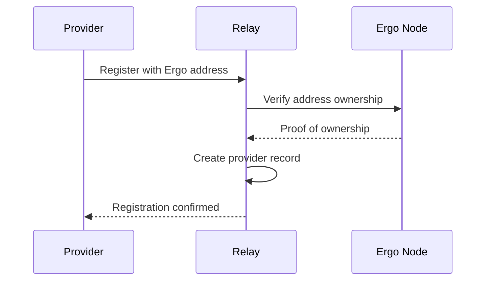
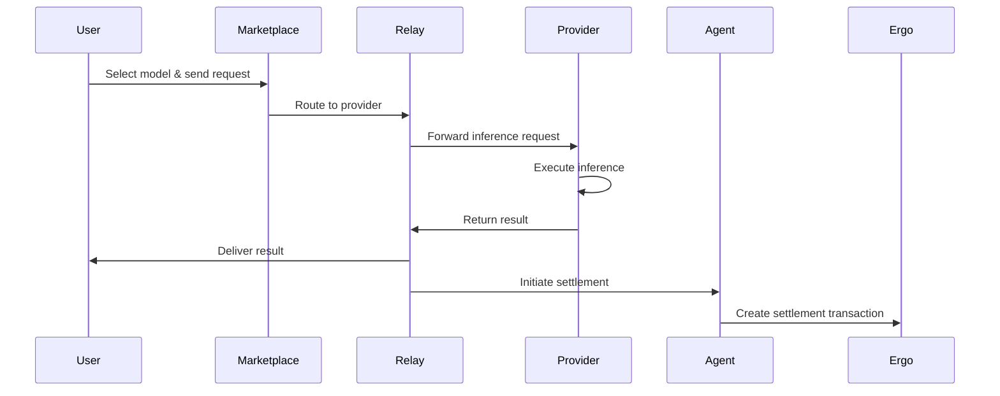
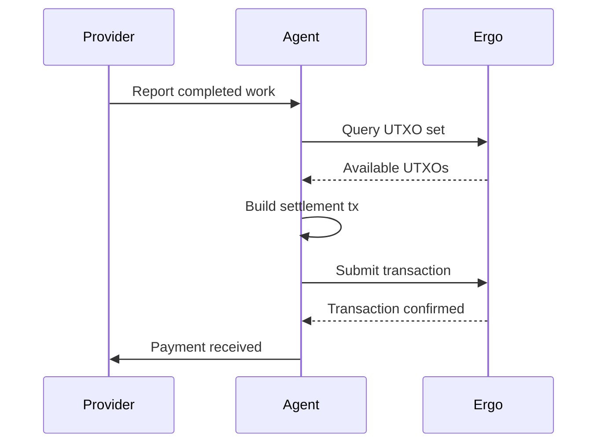

# 🚀 Xergon Network - Introduction

> **Decentralized AI Inference Marketplace on the Ergo Blockchain**

---

## 📖 What is Xergon?

Xergon is a **decentralized marketplace** for AI inference, built on the **Ergo blockchain**. It connects AI model providers with users who need inference services, creating a trustless, transparent, and economically sustainable ecosystem.

### 🔑 Key Features

- **🤝 Decentralized Marketplace**: Connect providers and users without intermediaries
- **🔐 Trustless Verification**: Proof-of-Neural-Work (PoNW) ensures computational integrity
- **💰 Economic Incentives**: Token-based settlement with ERG
- **🌐 Permissionless**: Anyone can join as a provider or user
- **🔒 Privacy-Preserving**: Zero-knowledge proofs for sensitive data
- **⚡ High Performance**: Optimized for low-latency inference

---

## 🎯 Problem Statement

### The Current AI Inference Landscape

1. **Centralized Control**
   - Major AI providers control the market
   - Single points of failure
   - Censorship risks

2. **Lack of Transparency**
   - Opaque pricing models
   - Unclear computational requirements
   - No audit trail

3. **High Costs**
   - Premium pricing for inference
   - Middleman fees
   - Geographic restrictions

4. **Security Concerns**
   - Data privacy risks
   - Single point of compromise
   - No cryptographic guarantees

### Xergon's Solution

Xergon addresses these challenges by:

- **Decentralizing** the inference market
- **Transparent** pricing and settlement
- **Cryptographic** verification of computation
- **Permissionless** access for all participants
- **Economic** incentives for quality service

---

## 🏗️ System Architecture

### Core Components

```
┌─────────────────────────────────────────────────────────────┐
│                    Xergon Marketplace                       │
│                                                             │
│  ┌──────────────┐  ┌──────────────┐  ┌──────────────┐     │
│  │   Provider   │  │   Provider   │  │   Provider   │     │
│  │   (GPU)      │  │   (TPU)      │  │   (CPU)      │     │
│  └──────┬───────┘  └──────┬───────┘  └──────┬───────┘     │
│         │                  │                  │             │
│         └──────────────────┼──────────────────┘             │
│                            │                                │
│                    ┌───────▼───────┐                        │
│                    │   Xergon      │                        │
│                    │   Relay       │                        │
│                    │   (API)       │                        │
│                    └───────┬───────┘                        │
│                            │                                │
│         ┌──────────────────┼──────────────────┐             │
│         │                  │                  │             │
│  ┌──────▼───────┐  ┌───────▼───────┐  ┌───────▼───────┐   │
│  │   User       │  │   Developer   │  │   Enterprise  │   │
│  │   (Client)   │  │   (SDK)       │  │   (API)       │   │
│  └──────────────┘  └───────────────┘  └───────────────┘   │
│                                                             │
│  ┌───────────────────────────────────────────────────────┐ │
│  │                  Ergo Blockchain                       │ │
│  │  - Provider Registration                              │ │
│  │  - Proof-of-Neural-Work                               │ │
│  │  - Settlement & Payments                              │ │
│  │  - Smart Contracts                                    │ │
│  └───────────────────────────────────────────────────────┘ │
└─────────────────────────────────────────────────────────────┘
```

### Component Overview

#### 1. **Xergon Relay** (Rust Backend)
- RESTful API for all interactions
- Provider registration and discovery
- Request routing and load balancing
- Authentication and authorization
- Rate limiting and DoS protection

#### 2. **Xergon Agent** (Rust Sidecar)
- Proof-of-Neural-Work (PoNW) computation
- Ergo node integration
- UTXO management
- Transaction building
- Settlement automation

#### 3. **Xergon Marketplace** (Next.js Frontend)
- User interface for browsing providers
- Model selection and pricing
- Payment management
- Usage analytics
- Provider dashboard

#### 4. **Xergon SDK** (TypeScript)
- Easy integration for developers
- Automatic provider selection
- Request signing and verification
- Error handling and retries
- TypeScript-first API

---

## 🔬 How It Works

### 1. Provider Registration



1. Provider generates Ergo wallet
2. Provider registers with Relay
3. Relay verifies ownership via Ergo node
4. Provider becomes available for requests

### 2. Request Flow



### 3. Settlement Process



---

## 💰 Economic Model

### Provider Economics

**Revenue Streams:**
- Inference requests (per token/token)
- Priority processing fees
- Custom model hosting

**Costs:**
- Hardware (GPU/TPU)
- Electricity
- Network bandwidth
- ERG transaction fees

**Incentives:**
- Competitive pricing attracts more requests
- High uptime = better reputation = more business
- Early adopters benefit from network effects

### User Economics

**Pricing Model:**
- Pay-per-use (no subscription required)
- Transparent pricing (visible on-chain)
- Competitive market rates

**Benefits:**
- No vendor lock-in
- Global access
- Cryptographic guarantees

---

## 🛡️ Security Model

### Proof-of-Neural-Work (PoNW)

Xergon uses a novel **Proof-of-Neural-Work** mechanism to ensure:

1. **Computational Integrity**
   - Providers prove they executed the inference
   - No result forgery possible
   - Cryptographic verification

2. **Economic Security**
   - Staking requirements for providers
   - Slashing for malicious behavior
   - Insurance fund for users

3. **Privacy Preservation**
   - Zero-knowledge proofs for sensitive data
   - Encrypted inference requests
   - Secure enclaves (optional)

### Threat Model

| Threat | Mitigation |
|--------|------------|
| **Provider collusion** | Decentralized network, economic incentives |
| **Result forgery** | PoNW verification, on-chain settlement |
| **DDoS attacks** | Rate limiting, provider diversity |
| **Data leakage** | Encryption, secure enclaves |
| **Smart contract bugs** | Audits, formal verification |

---

## 🚀 Getting Started

### For Providers

1. **Set up Ergo Node**
   ```bash
   # Follow Ergo node setup guide
   # https://docs.ergoplatform.com/
   ```

2. **Register as Provider**
   ```bash
   # See: docs/PROVIDER_ONBOARDING.md
   ```

3. **Start Serving Requests**
   ```bash
   # See: xergon-relay/README.md
   ```

### For Users

1. **Access Marketplace**
   ```bash
   # See: LOCAL-SETUP-GUIDE.md
   npm run dev
   ```

2. **Select Model & Send Request**
   - Browse available providers
   - Choose model and parameters
   - Pay with ERG

3. **Receive Result**
   - Cryptographically verified
   - Delivered instantly
   - On-chain settlement

### For Developers

1. **Install SDK**
   ```bash
   npm install @xergon/sdk
   ```

2. **Integrate**
   ```typescript
   import { XergonClient } from '@xergon/sdk'
   
   const client = new XergonClient({
     providerId: 'your-provider-id'
   })
   
   const result = await client.inference({
     model: 'llama-2-70b',
     prompt: 'Hello, world!'
   })
   ```

---

## 📊 Current Status

### ✅ Working Components

- [x] Provider registration system
- [x] Settlement flow
- [x] Authentication middleware
- [x] Heartbeat system
- [x] Rate limiting
- [x] Dead code cleanup
- [x] Build & testing
- [x] Documentation

### 🚧 In Progress

- [ ] Mainnet deployment
- [ ] Advanced PoNW mechanisms
- [ ] Privacy-preserving features
- [ ] Mobile SDK
- [ ] Enterprise integrations

### 📅 Roadmap

See [ROADMAP.md](./ROADMAP.md) for detailed timeline.

---

## 🏆 Competitive Advantages

| Feature | Xergon | Centralized |
|---------|--------|-------------|
| **Decentralization** | ✅ Yes | ❌ No |
| **Transparency** | ✅ On-chain | ❌ Opaque |
| **Censorship Resistance** | ✅ Yes | ❌ No |
| **Cost** | ⭐⭐⭐⭐⭐ Market | ⭐⭐ Premium |
| **Privacy** | ✅ Cryptographic | ❌ Provider trust |
| **Uptime** | ✅ Distributed | ⚠️ Single point |
| **Global Access** | ✅ Yes | ⚠️ Restricted |

---

## 📚 Further Reading

- [**LitePaper**](./Xergon%20LitePaper.md) - Technical overview
- [**Architecture**](./docs/architecture.md) - System design
- [**Provider Guide**](./docs/PROVIDER_ONBOARDING.md) - Join as provider
- [**SDK Docs**](./xergon-sdk/README.md) - Developer integration
- [**Security Audit**](./docs/SECURITY_AUDIT.md) - Security review

---

## 🤝 Community

- **GitHub**: [n1ur0/Xergon-Network](https://github.com/n1ur0/Xergon-Network)
- **Discord**: [Join our community](https://discord.gg/xergon) (placeholder)
- **Twitter**: [@XergonNetwork](https://twitter.com/XergonNetwork) (placeholder)
- **Forum**: [Ergo Forum](https://forum.ergoplatform.org) (Ergo ecosystem)

---

## 📜 License

- **Code**: [MIT License](./LICENSE)
- **Documentation**: [CC BY 4.0](https://creativecommons.org/licenses/by/4.0/)

---

**Built with ❤️ on the Ergo Blockchain**
